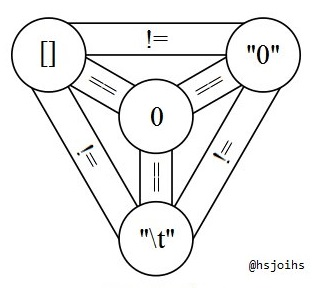

# JavaScript Introduction
> It'll only sting for a moment.

## wat

```js
{} + []
[] + {}
[] + []
```

Here's a hint.

```js
[] + [] + {}
'i am a ' + {}
```

The addition operator either performs string concatenation or numeric addition.

Take away: don't add not numbers.

```js
0 >= null
0 == null
0 > null
```

## Topics

- do not thy non-numbers add
- truthiness
- triple equals
- template strings
- what is this
- classes

## Truthiness

Truthiness is the process of simplifying any value to `true` or `false`, like during `if` statements.

```js
Boolean(false)
Boolean(0)
Boolean(-0)
Boolean('')
Boolean(null)
Boolean(undefined)
Boolean(NaN)
```

Everything else is truthy. This makes for some useful shortcuts, like when using the ternary operator to define a default value.

```js
const foo = ''
const bar = 'bar'
// if foo is truthy then return foo else return 'baz'
foo ? foo : 'baz'
// if bar is truthy then return bar else return 'baz'
bar ? bar : 'baz'
```

The Boolean operators work fine for `if` conditions, but also function as null-coalescing operators too.

```js
true || 'baz'
false || 'baz'
```

```js
true && 'baz'
false && 'baz'
```

In functions with optional parameters, a developer should prefer to test truthiness instead of type unless types need to be distinguished.

```js
function print (msg) {
  if (typeof msg !== 'undefined') {
    console.info(msg)
  }
}
```

```js
function print (msg) {
  if (msg) console.info(msg)
}
```

## Triple Equals

`==` in JS is not the same as `==` in any other language.

Using `==` in JS is a loose comparison. `===` is the strict comparison similar to other languages.

All you should know about `==` is that it will go out of its way to make the left and right hand sides the same type. `==` should only be used for code golf.



## Template Strings

If you shouldn't use the addition operator to build strings, how should you?

```js
const thing = 'message'
`this is my ${thing}`
```

## Functions and Binding

```js
function fn () {
  console.info('called')
}
```

Normal stuff going on here. Ready for the not-normal stuff?

```js
function another () {
  return this
}

another() // global scope returns

const obj = {another}
obj.another() // obj returns

const fn1 = obj.another
a1() // global scope returns

const fn2 = obj.another.bind(obj)
a2() // obj returns
```

## Classes

```js
class Foo {
  constructor () {
    this.val = 0
  }
  inc () {
    this.val++
  }
  dec () {
    this.val--
  }
}

const f = new Foo()
f.val
f.inc()
f.val
```

Classes tend to cause anti-patterns in JS, though. The lack of strict typing lends to functional code, not object-oriented.

It is often better to simply have functions that accept all of the state they need as parameters. This will also make unit testing easier and better compartmentalize the codebase.
