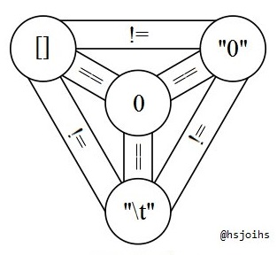

# JavaScript Introduction
> It'll probably work and you will never realize what crimes you committed.

**For more complete information, see OSU CASS SDG's [JavaScript training document](https://github.com/osu-cass/JavaScriptTraining) I have been working on.**

When people laugh at JavaScript, it's probably because of stuff like this:

```js
0 > null    // returns false
0 == null   // also false
0 >= null   // returns... true?
```

JavaScript's flexibility will hurt to adapt to, but it is not a bad thing. A
couple of testimonies:

> I also have grown to like the prototypical nature of JavaScript and other
> prototypical languages like Lua.  I’ve always been a big fan of statically typed
> languages, and I still am, but I can also now appreciate some of the patterns
> that only a prototypical language allows which can really allow you to do quite
> a bit with just a little code.
>
> [John Sonmez, "I Was Wrong About JavaScript and Responsive Design"](https://simpleprogrammer.com/2013/12/09/wrong-javascript-responsive-design/) in Dec 2013

And a comment about loosely typed languages:

> > “Whilst not conclusive, the lack of evidence in the charts that more advanced
> > type languages are going to save us from writing bugs is very disturbing.” 
> >
> > Daniel Lebrero, “The Broken Promise of Static Typing”
>
> [Eric Elliott, "The Shocking Secret About Static Types"](https://medium.com/javascript-scene/the-shocking-secret-about-static-types-514d39bf30a3) in Jun 2016

While JS is definitely a strange language, it simply relies on you, the programmer,
to enforce your own set of rules. Once you get the hang of its quirks, and you understand
some of its tools and best practices, writing in JavaScript becomes a pleasure.

## Topics

This introduction will only discuss language quirks.

- [x] addition operator
- [x] truthiness
- [x] triple equals
- [x] template strings
- [x] this
- [ ] ~~prototypes~~ (need to go back over this)

We'll cover these things and more in the future:

- [ ] project directory structure
- [ ] bundling JS
- [ ] ecmascript 2015/2016/2017
- [ ] web apps and react/vdom
- [ ] typescript

---
## Addition Operator
> Do not thy non-numbers add.

The addition operator comes from a very strange land.

```js
{} + []          // returns 0
[] + {}          // returns '[object Object]'
[] + []          // returns ''
[] + [] + {}     // returns '[object Object]'
'i am a ' + {}   // returns 'i am a [object Object]'
```

None of that came out as you would expect it, because the addition operator either
performs string concatenation or numeric addition. It won't catch you when you try
something weird, like adding arrays.

Take away: don't add non-numbers. We have a way to handle strings, which we'll touch
on next.

---
## Template Strings
> Just use them please.

If you shouldn't use the addition operator to build strings, how should you?

```js
const thing = 'message'
console.log(`this is my ${thing}`)  // 'this is my message'

// Only ` (backticks) can fill in variables/expressions
console.log('this is my ${thing}')  // 'this is my ${thing}'
console.log("this is my ${thing}")  // 'this is my ${thing}'

// Also useful for avoiding escaping
console.log(`"You don't need to worry about apostrophes and quotation marks", he said.`)
```

---
## Truthiness
> Existence is truth.

Truthiness is the process of simplifying any value to `true` or `false`, like during
`if` statements.

```js
// All of these expressions return false
Boolean(false)
Boolean(0)
Boolean(-0)
Boolean(NaN)
Boolean('')
Boolean(null)
Boolean(undefined)
```

Everything else is truthy. This makes for some useful shortcuts, like when using
the ternary operator to define a default value.

```js
const foo = ''
const bar = foo ? foo : 'baz' // if foo is truthy, return foo; if falsey, return 'baz'
console.log(bar)              // 'baz'

const baz = 'baz'
const qux = baz ? baz : 'qux' // if baz is truthy, return baz; if falsey, return 'qux'
console.log(qux)              // 'baz'
```

The Boolean operators work fine for `if` conditions, but also function as null-coalescing
operators too.

```js
// The OR operator returns the first value that is truthy, or the last if it can't find one
true || 'baz'  //  true
false || 'baz' // 'baz'
```

```js
// The AND operator returns the first falsey value, or the last if it can't find one
true && 'baz'  // 'baz'
false && 'baz' // false
```

In functions with optional parameters, a developer should prefer to test truthiness
instead of type unless types need to be distinguished.

```js
const current = {
  name: '',
  type: 'developer'
}

// This is bad
function getName(member) {
  if (typeof member.name !== 'string') {
    console.info(member.name)
  } else {
    console.info(`unnamed ${member.type}`)
  }
}

// This is good
function getName(member) {
  console.info(member.name || `unnamed ${member.type}`) // Short-circuits if member.name is undefined
}
```

---
## Triple Equals
> Strict equivalence does not strictly equal loose equivalence.

`==` in JS is not the same as `==` in any other language.

```js
// The == operator comes from the same land as the + operator
false == ''   // true
false === ''  // false

0 == '0'      // true
0 === '0'     // false

// Same thing for != and !==
false != ''   // false
false !== ''  // true

// It uses truthiness erratically
false == ''   // true
false == null // false
```

Using `==` in JS is a loose comparison. `===` is the strict comparison similar to
other languages.

All you should know about `==` is that it will go out of its way to make the left
and right hand sides the same type. `==` should only be used for code golf.



---
## Functions
> What is this?

```js
// Normal form
function normal () {
  console.info('called')
}
normal()   // 'called'

// Also valid
var valid = function () {
  console.info('called')
}
valid()    // 'called'

// Fat arrow
var arrow = () => {
  console.info('called')
}
arrow()    // 'called'
```

```js
const whereAmI = 'global'

const fn = function () {
  if (true) {
    var nogood = 'function scoped'
    let better = 'block scoped'
  }
  console.info('nogood', typeof nogood)
  console.info('better', typeof better)
  console.info('global', typeof whereAmI)
}

fn()   // nogood string
       // better undefined
       // global string
```

Arrow functions allow us to write things more compact:

```js
// With function definitions
function sum (list) {
  return list.reduce(function (val, acc) {
    return val + acc;
  }, 0);
}

// Using arrow functions
const sum2 = list => list.reduce((v, a) => v + a, 0)
```

That was all the normal stuff. Ready for the not-normal stuff?

```js
const member = {
  name: 'Rob',
  getName () {
    return this.name
  }
}

member.getName()   // 'Rob'

let getMemberName = member.getName   // Copy member.getName to a variable

getMemberName()    // undefined
```

What is `this`? `this` is set while functions are being called.

```js
getMemberName = member.getName.bind(member)  // Tell the variable to refer to member as this
getMemberName()    // 'Rob'

getMemberName = () => member.getName()       // Accomplishes the same thing
getMemberName()    // 'Rob'
```

---
## Classes
> Just because it is familiar does not mean it is better.

```js
class Foo {
  constructor () {
    this.val = 0
  }
  inc () {
    this.val++
  }
  dec () {
    this.val--
  }
}

const f = new Foo()  // Instantiate our defined class
f.val     // 0
f.inc()   // Call method that modifies internal state
f.val     // 1
```

Classes tend to cause anti-patterns in JS, though.

- The aforementioned `this` problem especially shows itself in classes.
- JS is loosely typed and lends to functional code, not object-oriented.
- Most all frameworks for JS save state and you don't need to.
- The performance benefit isn't worth the technical debt and bloat.
- Most of the time, the dev user of your class will not get IntelliSense.
- Tend to lead to articles titled "[How to Use Classes and Sleep at Night](https://medium.com/@dan_abramov/how-to-use-classes-and-sleep-at-night-9af8de78ccb4)"
- The creator of JS says you shouldn't use them.

It is often better to simply have functions that accept all of the state they need
as parameters. This will also make unit testing easier and better compartmentalize
the codebase.

```js
const inc = val => val + 1     // Reusable, pure functions
const dec = val => val - 1     // accept state, return new state

const initVal = 0;
const nextVal = inc(initVal);  // Original state, initVal, is unmodified
const lastVal = dec(nextVal);  // Original state, nextVal, is unmodified
```

---
Some strongly suggested rules for modern JS development:

- Use a debugger such as your browser's devtools, Node's included one, or VSCode.
- Prefer `const` everywhere.
- Don't use classes (except for React).
- Don't use globals or namespaces.
- Write [functional code](https://medium.com/javascript-scene/master-the-javascript-interview-what-is-functional-programming-7f218c68b3a0) (accept a state, return a new state).
- Use promises, streams, events, and callbacks, in that order.
- Observables are good but I haven't used them.
- https://www.destroyallsoftware.com/talks/the-birth-and-death-of-javascript
- https://github.com/osu-cass/JavaScriptTraining

Never stop learning, and write code for peace.

|[](https://github.com/maccelerated)|](https://github.com/monochromicon)|
|---|---|
|[@maccelerated](https://github.com/maccelerated)|[@monochromicon](https://github.com/monochromicon)
